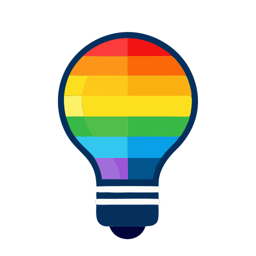

# bulb 

A command-line interface for controlling Wyze smart color bulbs.

## About

This project was developed as a experiment between human and AI to create a functional command-line tool for controlling Wyze smart bulbs. The AI (Claude) was tasked with creating a complete CLI interface using the existing [wyze-sdk](https://github.com/shauntarves/wyze-sdk) Python library as a foundation.  Basically, it's an unstable reverse engineered API, and I wanted to see if it can adapt without requiring heavy human intervention.  It wasn't coded using an agent, just the web interface.

Still, it's useful for my purposes.  Maybe yours, too.  **BUT NOTE THE SHEBANG.**

I did throw in some oddball personal quirks that I typically use for my own tools.  For instance: --installmanpage, which installs a `$HOME/.local/share/man` based man page.

## AI Weirdness

I think the rc files vary by whitespace usage.  That's... really insanely dumb.  But it works.  

Your password is stored.  In your home directory with a 600 chmod, so I'm okay with that.  Wyze is weird with security since they messed up with their early webcam products, and are now kind of paranoid.  It seems they require you relogin now and then, and this allows that.  Paranoia on their end is welcome, so I'm okay.

There were a few quirks that I don't think somebody without Python experience could have fixed.  This isn't quite vibe coding, and I was extremely explicit about the usage patterns I wanted, based on my needs and decades of using \*nix cli tools.

## Technical Notes

### Features

- 🎨 **Color Control**: Set bulb colors using hex values or named colors
- 🔆 **Brightness Control**: Adjust brightness from 0-100%
- 📝 **Bulb Management**: Add, remove, and list configured bulbs
- 🔍 **Auto-Discovery**: Automatically find and add all Wyze bulbs in your account
- 🎨 **Custom Colors**: Define and save custom color names
- 🔐 **Secure Authentication**: Encrypted credential storage with token caching
- 📖 **Comprehensive Help**: Built-in manual page and help system
- 🔄 **Smart Caching**: Automatic token management to avoid API rate limits

### Limitations

- **Color Bulbs Only**: Designed specifically for Wyze color light bulbs
- **Hardcoded Python Path**: Uses a hardcoded shebang pointing to the author's virtual environment
- **Unofficial API**: Built on reverse-engineered Wyze API through wyze-sdk

### TODO

- Likely going to add named groups of lighting.  That's part of why you add names.
- Fix the oddness of the .rc formats so they are all cohesive. 

### Prerequisites

- Python 3.8+
- Wyze account with color bulbs
- Wyze API credentials (Key ID and API Key)

## Installation

### 1. Install wyze-sdk

```bash
pip install wyze-sdk
```

### 2. Get the Script

Download the `bulb` script and make it executable:

```bash
chmod +x bulb
```

### 3. Update the Shebang

**Important**: The script has a hardcoded shebang that needs to be updated for your system:

```python
#!/home/evan/.local/pipx/venvs/bulb/venv/bin/python
```

Change this to point to your Python installation with wyze-sdk available.

### 4. Install to PATH (Optional)

```bash
sudo cp bulb /usr/local/bin/
```

## Setup

### 1. Get Wyze API Credentials

Visit the [Wyze Developer Console](https://developer-api-console.wyze.com/#/apikey/view) to create an API key. You'll need:
- API Key ID
- API Key
- Your Wyze account email and password

### 2. Configure Authentication

```bash
bulb --auth
```

This will prompt you for all four required credentials and test the connection.

### 3. Discover Your Bulbs

```bash
# List all bulbs in your account
bulb --list

# Automatically add all discovered bulbs
bulb --addall
```

## Usage

### Basic Commands

```bash
# View help
bulb --help

# Install manual page
bulb --installmanpage

# List all bulbs (configured ones marked with #)
bulb --list

# Add a bulb manually
bulb "Living Room" --add ABCDEF1234567890 WLPA19C

# Remove a bulb
bulb "Living Room" --remove
```

### Controlling Bulbs

```bash
# Set brightness to 40%
bulb "Living Room" 40

# Turn bulb off
bulb "Living Room" 0

# Set bulb to blue with 80% brightness
bulb "Living Room" 0000ff 80

# Set bulb to red with 30% brightness (arguments can be in any order)
bulb "Living Room" 30 FF0000

# View current bulb state
bulb "Living Room" --view
```

### Color Management

```bash
# Add a custom color
bulb --color green 00ff00

# Use custom color
bulb "Living Room" green

# Set custom color with brightness
bulb "Living Room" green 75
```

### Verbose Mode

```bash
# Show detailed debug information
bulb --verbose --list
bulb --verbose "Living Room" red 50
```

## File Locations

The application stores configuration files in `~/.local/share/bulb/`:

- `bulbs.rc` - Bulb definitions (name, MAC address, model)
- `colors.rc` - Custom color definitions  
- `auth.rc` - Authentication credentials (encrypted, mode 600)
- `tokens.rc` - Cached API tokens (encrypted, mode 600)

## Configuration File Formats

### bulbs.rc
Tab-separated format:
```
# Bulb definitions: name	mac	model
Living Room	ABCDEF1234567890	WLPA19C
Kitchen Light	1234567890ABCDEF	WLPA19C
```

### colors.rc  
Space-separated format:
```
# Color definitions
red ff0000
green 00ff00
blue 0000ff
purple 800080
```

## Examples

### Complete Setup Workflow

```bash
# 1. Set up authentication
bulb --auth

# 2. Discover and add all bulbs
bulb --addall

# 3. Add some custom colors
bulb --color sunset ff6b35
bulb --color ocean 006994

# 4. Control your bulbs
bulb "Living Room" sunset 60
bulb "Kitchen" ocean 80
bulb "Bedroom" 0  # Turn off
```

### Daily Usage

```bash
# Morning routine
bulb "Bedroom" white 30
bulb "Kitchen" white 80

# Evening ambiance  
bulb "Living Room" sunset 40
bulb "Bedroom" red 10

# Night time
bulb "Living Room" 0
bulb "Kitchen" 0
```

## Troubleshooting

### Rate Limiting (429 Errors)

The application uses token caching to avoid rate limits. If you see 429 errors:

1. Wait a few minutes before trying again
2. The app will cache tokens after successful authentication
3. Subsequent commands should use cached tokens

### Authentication Issues

```bash
# Re-authenticate if having issues
bulb --auth

# Check verbose output for debugging
bulb --verbose --list
```

### Bulb Not Found

```bash
# List all bulbs to see what's available
bulb --list

# Add missing bulbs automatically
bulb --addall

# Or add manually
bulb "Bulb Name" --add MAC_ADDRESS MODEL
```

## Development Notes

This project represents an interesting experiment in AI-assisted development:

- **Human Role**: Requirements specification, testing, and refinement
- **AI Role**: Code implementation, documentation, and problem-solving
- **Collaboration**: Iterative development with human feedback guiding AI improvements

The AI successfully:
- ✅ Created a functional CLI interface from scratch
- ✅ Implemented token caching to solve rate limiting
- ✅ Added comprehensive error handling
- ✅ Created proper documentation and help systems
- ✅ Handled edge cases and user experience concerns

## Contributing

Since this is an experimental project with a hardcoded environment path, it's not designed for general distribution. However, the code serves as an interesting example of AI-assisted development and could be adapted for broader use.

## License

This project is provided as-is for experimental and educational purposes.

## Acknowledgments

- **[wyze-sdk](https://github.com/shauntarves/wyze-sdk)** by Shaun Tarves - The underlying Python library that makes this possible
- **Claude (Anthropic)** - AI assistant that implemented the majority of the codebase
- **Wyze Labs** - For creating affordable smart home devices with an accessible API

## Disclaimer

This is an unofficial tool that uses reverse-engineered APIs. It may break if Wyze changes their API. Use at your own risk. The authors are not affiliated with Wyze Labs.